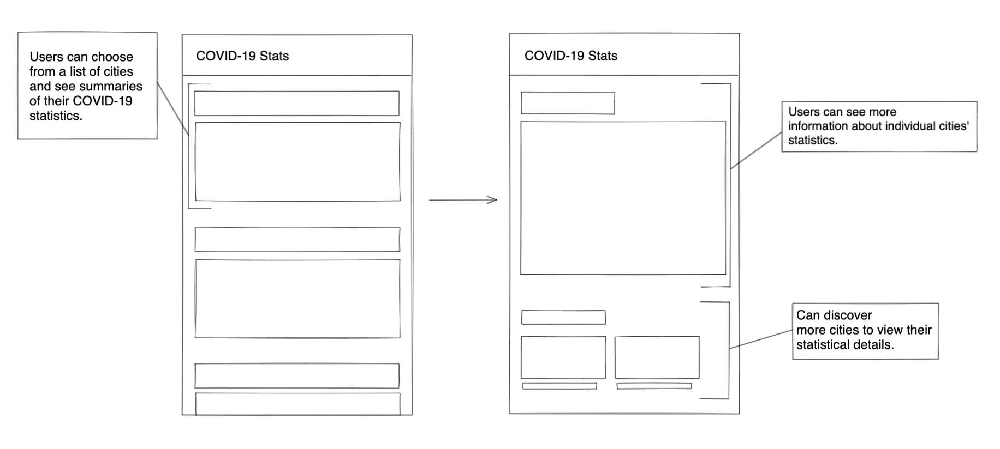
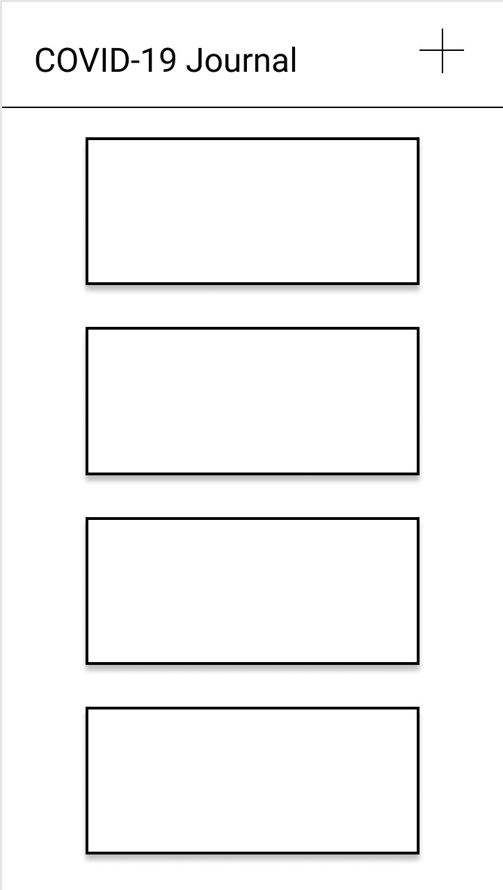
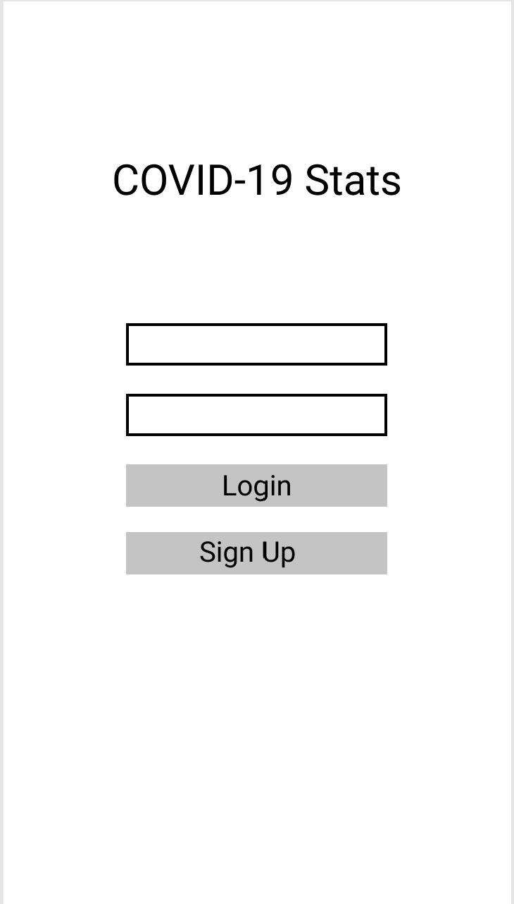

Original App Design Project
===

# COVID-19 STATS

## Table of Contents
1. [Overview](#Overview)
1. [Product Spec](#Product-Spec)
1. [Wireframes](#Wireframes)
2. [Schema](#Schema)

## Overview
### Description
This mobile app provides up-to-date information about the COVID-19 pandemic using Google COVID-19 statistics data. The user will be able to look up information for specific locations such as testing sites, current infection and death rates, as well as prevention guidelines. In addition, user's can keep a "COVID Journal" to record their symptons/treatment, quarantine progress and keep track of places/people they visited.

### App Evaluation
[Evaluation of your app across the following attributes]
- **Category:** Education/Public Information
- **Mobile:** 
    * Information will be available offline (real-time)
    * Can Upload audio entries into COVID Journal
    * Can enable location to instantly provide relevant statistics
- **Story:**
    * It provides users with an personal way to understand the current state of the COVID 19 pandemic. 
- **Market:**
    * The app is made for users who are generally concerned about COVID stats and want quick information.
    * The app specifically caters to users were potentially exposed to COVID-19 because it provides a private platform to track their health.
- **Habit:**
    * The passive user can easily check COVID-19 statistics at least once a day.
    * The active user who is concerned about being exposed to COVID can create a mobile journal.
- **Scope:**
    * The project's MVP can be completed in the timeline of the course. However, the design of the app (in terms of how data is displayed) will take considerable time and may not be finished in the time period.

## Product Spec

### 1. User Stories (Required and Optional)

**Required Must-have Stories**

* User can view COVID-19 death and infection rates in the United States
* User can view COVID-19 death and infection rates by state in the United States
* User can view updated safety information
* User can login and create written and audio entries in a personal COVID Journal

**Optional Nice-to-have Stories**

* User can use their location to automatically view relevant COVID-19 stats
* User can get relevant information about testing centers near them (directions, phone number, website, etc.)
* User can download Journal in a pdf file to print or share
* User can save locations that they are interested in

### 2. Screen Archetypes

* Search
   * User can search for locations to see stats
* Stats Stream 
   * User can view list of stats for relevant locations
* Detail 
   * User can view more stats from a specific location
* Login 
   * User can login to access Covid Journal
* Journal Stream
   * User can view all the Journal entries they have made
* Entry Creation 
   * User can edit text or add audio to post a journal entry


### 3. Navigation

**Tab Navigation** (Tab to Screen)

* Location Stats
* COVID-19 Journal
* Logout 

**Flow Navigation** (Screen to Screen)

* Login
   * => Location Stream
* Location Stats Stream
   * => Location Search
       * => Location Stats Stream
           * => Location Detail
* COVID-19 Journal Stream
   * => Entry Creation

## Wireframes
### [BONUS] Digital Wireframes & Mockups



### [BONUS] Interactive Prototype

## Schema 
[This section will be completed in Unit 9]
### Models
| property     | Type            | Description                                     |
|--------------|-----------------|-------------------------------------------------|
| objectId     | String          | Unique id for the user login                    |
| image        | File            |    Images of   covid cities/statistics          |
| createdAt    | DateTime        | date when covid post is created (default field) |
| updatedAt    | DateTime        | date when covid post is updated (default field) |
| journalEntry | String          | Entry by author                                 |
| author       | Pointer to User | entry author                                    |
| statistics   | String          | Statistics for each city                        |
### Networking
* Login Screen
    * (Create/POST) Sign up and create a new user
        ```swift
        ParseObject newUser = new    ParseObject("User");
        newUser.put("username", "Bob");
        newUser.put("password", "Day 5");
        newUser.saveInBackground();
        ```
* Location Stats Screen
    * (Read/GET) Display COVID-19 Stats 
        ```swift
             let query = PFQuery(className:"Stats")
             query.whereKey("locations", equalTo: states)
             query.order(byDescending: "createdAt")
             query.findObjectsInBackground { (entries: [PFObject]?, error: Error?) in
                if let error = error { 
                   print(error.localizedDescription)
                } else if let stats = stats {
                   print("Successfully retrieved \(posts.count) posts.")
               // TODO: Do something with stats for specific locations...
                }
             }
* Journal Stream Screen
    * (Read/GET) Displays all the previous entries that have been made from the logged in user
        ```swift
             let query = PFQuery(className:"Entry")
             query.whereKey("author", equalTo: currentUser)
             query.order(byDescending: "createdAt")
             query.findObjectsInBackground { (entries: [PFObject]?, error: Error?) in
                if let error = error { 
                   print(error.localizedDescription)
                } else if let entries = entries {
                   print("Successfully retrieved \(posts.count) posts.")
               // TODO: Do something with entries...
                }
             }
             ```
    * (Delete) Remove existing entry
        ```swift
            jEntry.remove("playerName");
            jEntry.saveInBackground();
        ```
* Entry Creation
    * (Create/POST) Create a new entry to add to the stream 
        ```swift
        ParseObject jEntry = new ParseObject("JournalEntry");
        jEntry.put("date", 1337);
        jEntry.put("title", "Day 5");
        jEntry.put("text", content);
        jEntry.saveInBackground();
        ```
Base URL: https://api.covidtracking.com


| HTTP Verb | Endpoint | Description |
| -------- | -------- | -------- |
| GET    | /v1/us/current.json | Current COVID-19 Statistics for the US as a whole     |
| GET    | /v1/states/current.json | Current COVID-19 Statistics for all US states     |
| GET    | /v1/states/?state=state/current.json | Current COVID-19 Statistics for a specific state     |
| GET    | /v1/states/?state=state/info.json | Information about a specific state's response resources     |
